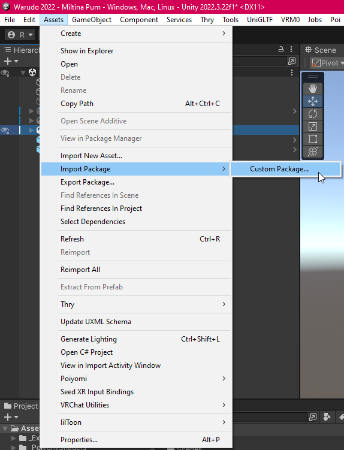
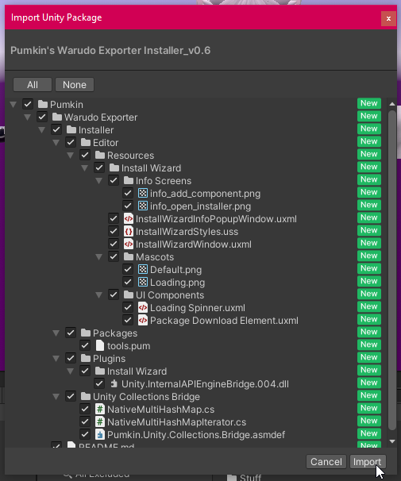
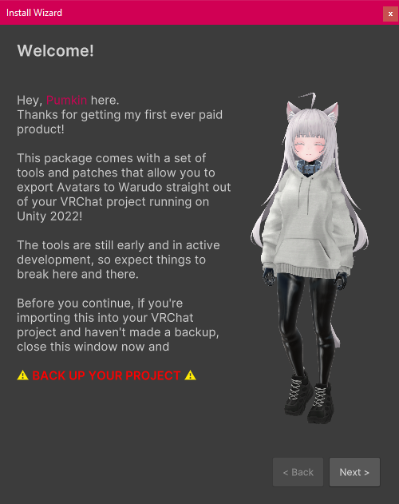

# Download & Installation

## Download

The download for this tool can be found on my [Patreon](https://www.patreon.com/c/notPumkin), included in the **Rare** tier, or any tiers above it.

I'll add more info here later.

## Installation

:::danger

While this tool is meant to go into a VRChat project it is **strongly** recommended to import it into a **copy of your project**.

Things can, and probably will break. Don't risk it, have a **backup**!

:::

### Importing into Unity

After downloading the .unitypackage file, import it into Unity by going to `Assets` > `Import Package` > `Custom Package`.

Then, click `Import` to confirm. This will import the installer package.

### Install Wizard
Once imported, the Install Wizard should pop up automatically. If it doesn't, you can find it under `Pumkin` > `Warudo Installer` in the top menu bar.

Follow the steps within it to get everything set up.