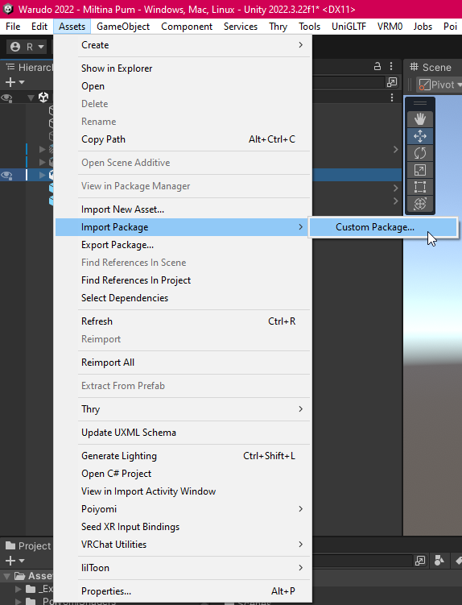
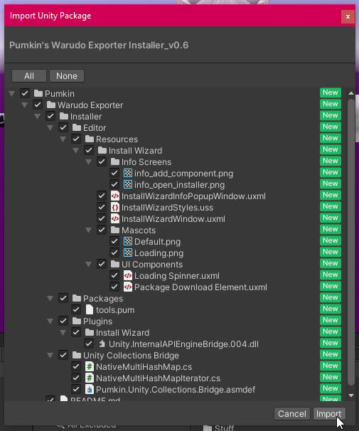
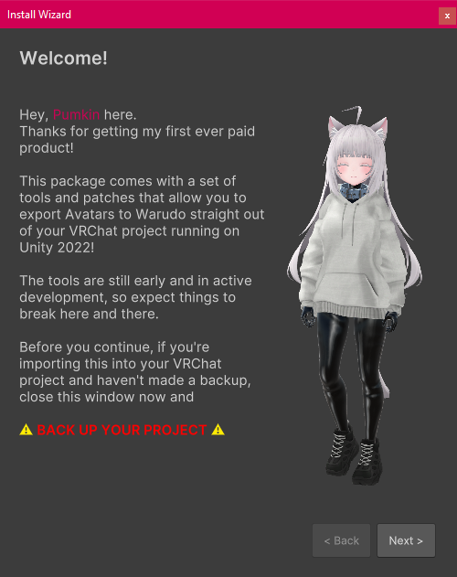
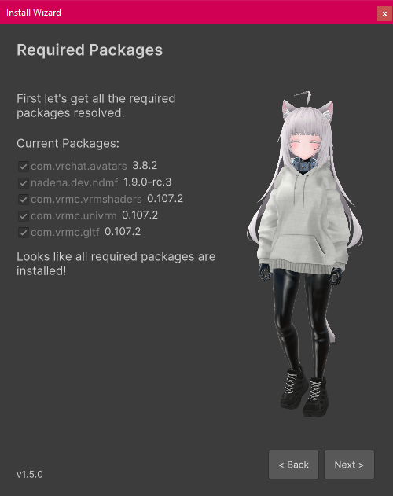
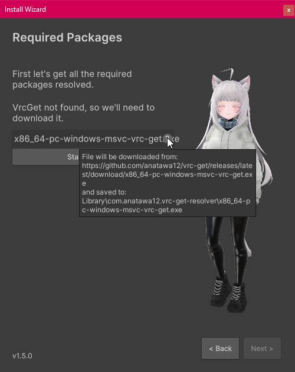
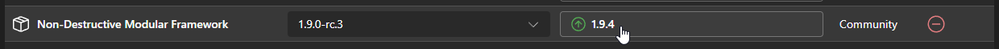

# Download & Installation

## Download

The download for this tool can be found on my [Patreon](https://www.patreon.com/c/notPumkin), included in the **Rare** tier, or any tiers above it.

I'll add more info here later.

## Installation

:::danger

While this tool is meant to go into a VRChat project it is **strongly** recommended to import it into a **copy of your project**.

Things can, and probably will, break. Don't risk it, have a **backup**!

:::

### Importing into Unity

After downloading the .unitypackage file, import it into Unity by going to `Assets` > `Import Package` > `Custom Package`.

Then, click `Import` to confirm. This will import the installer package.

### Install Wizard
Once imported, the Install Wizard should pop up automatically. If it doesn't, you can find it under `Pumkin` > `Warudo Installer` in the top menu bar.

Follow the steps within it to get everything set up.

#### Required Packages Step

During the required packages step, you will be asked to download [vrc-get](https://github.com/vrc-get/vrc-get/), an open source community developed command line client of VRChat Package Manager. It's used to download and import required packages.

In most cases you can just click on `Start Download` to automatically download and place vrc-get into the correct folder, but if for whatever reason this fails, it can also be done manually.
Putting your mouse over the (?) icon will let you know where the file can be downloaded from and where it needs to be placed.

The download is always going to come from the [official releases](https://github.com/vrc-get/vrc-get/releases/latest), and will always need to be placed in `<your project>/Library/com.anatawa12.vrc-get-resolver`.

After this, vrc-get can run and download and install all the required packages.

:::warning
Currently, vrc-get does not update packages for you. So if you have an outdated package, usually Non Destructive Modular Framework (NDMF), this installer step will succeed but the tool will still not work. For now, if you already have packages such as NDMF, make sure they are up to date in VRChat Creator Companion.

:::
