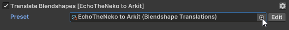
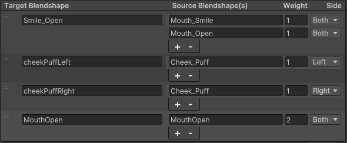

This feature is used to translates blendshapes on the avatar's meshes. This allows the exporter to rename, combine and split blendshapes on a mesh in order to make them work with blendshape names Warudo expects, for example [ARKit Blendshapes](https://arkit-face-blendshapes.com/) for face tracking.

This feature comes with the following option(s):

## Preset
This allows us to select a translation preset object for our avatar. Click the circle on the right to bring up the presets window and select one.

To create a new preset, right click in your `Assets` (Project tab) then,
 `Pumkin` > `Warudo Exporter` > `Blendshape Translations`. Alternatively, you can copy one of the existing presets that came with the tool.

Once selected, a preset can be edited by clicking the `Edit` button next to it. This pops up the translation window.
If you try to edit a build in preset, you'll be asked to create a copy before you can edit it.

Clicking `Create Copy` will create a copy of the current preset and put it into your `Assets` folder.

Next let's look at what everything does.

- `Target Blendshape`. This stores the name of the resulting blendshape.
- `Source Blendshape(s)`. This is a list that stores the names of blendshapes to be merged into a new blendshape with the name from the `Target Blendshape` field.
- `Weight`. This field serves as a "multiplier" for the blendshape data of each `Source Blendshape`. If the weight is 0, the source blendshape gets ignored. If the weight is 1, the source blendshape gets merged as is. If the weight is 2, the source blendshape is doubled in movement. If it's -1, it gets inverted and so on.
- `Side`. This option allows us to split the `Source Blendshape` down the center of the bounds of the mesh. If `Left` is selected, only the vertices to the left of the center of the mesh will be included, if `Right` is selected only the right ones. If `Both` is selected, well.. the whole blendshape gets copied.

## Build-in Presets
Currently, there's two build in presets:

### EchoTheNeko to ARKit
Use this preset if your avatar comes with a [EchoTheNeko](https://echotheneko.booth.pm/) face tracking prefab.

### Universal Expressions to ARKit
Use this preset if your avatar comes with [Jerry's Face Tracking](https://adjerry91.booth.pm/) or [Fermata Face Tracking](https://fermat.booth.pm/)

Would you like to see more in here or suggest improvements? Let me know!