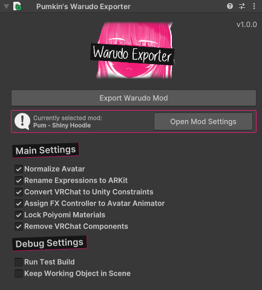

# Intro

The VRC to Warudo Exporter is a tool and set of [Harmony Patches](https://harmony.pardeike.net/) based on [Non-Destructive Modular Framework](https://github.com/bdunderscore/ndmf), that let you export your [VRChat](https://hello.vrchat.com/) avatar to [Warudo](https://warudo.app/) directly out of your Unity 2022 VRChat project.

Normally, this is not allowed as Warudo uses Unity 2021, but the tool attempts to resolve this by patching your avatar export behind the scenes. These non-destructive patches automatically modify a copy of your avatar as it's being built for export.

:::note

Please note that the tool is still in it's early stages, and while functional, things might not work for everyone from the start. Bare with me while I iron out the issues, and join the Discord if you want to give feedback.

:::

All this allows it to work in Warudo. Check [Technical Details](./technical-details) if you're interested in the nerdy details.