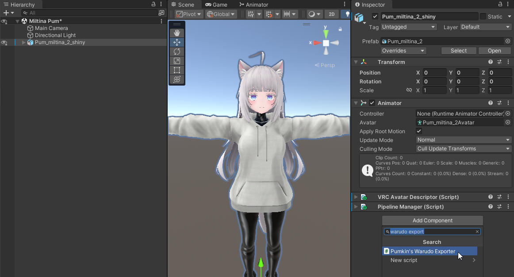
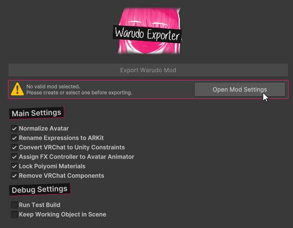
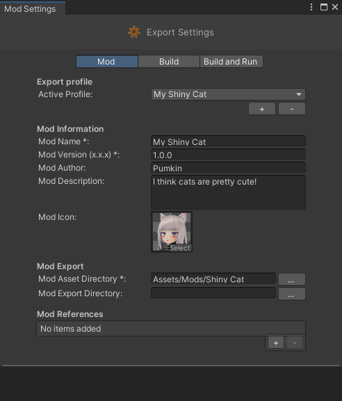
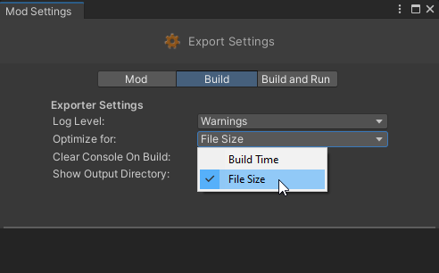
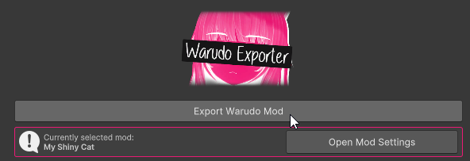

# Usage

## Add Component to Avatar
To use this, select your avatar in the scene, and add the `Pumkin's Warudo Exporter` component.

## Setting up a Mod

Before we can export, we need to [setup a new mod](https://docs.warudo.app/docs/modding/creating-your-first-mod). This can be done in either one of these menus:
 - `Warudo` > `New Mod`
 - `Warudo` > `Mod Settings` and clicking the `+` button.

 To make this easier, a button to open the `Mod Settings` menu is provided to you directly in the Exporter window.

Fill in your mod info and pick a folder for your mod files. This needs to be somewhere in your `Assets`.

Before we export, there's a setting worth considering in the `Build` tab. The `Optimize for` option plays a decent role in the resulting filesize.
- When optimizing for `File Size` my Character Mod ends up being 25mb.
- When optimizing for `Build Time` my Character Mod ends up being 130mb.

I don't know what else this changes. I haven't noticed much difference in build or loading times when optiziming for build time. It might be irrelevant for small mods like these, but still worth keeping in mind.

### Exporting

To export, press the big export button! Yep, that's it!

For more info on what to do with your exported mods, check the [Warudo Documentation](https://docs.warudo.app/docs/modding/creating-your-first-mod).