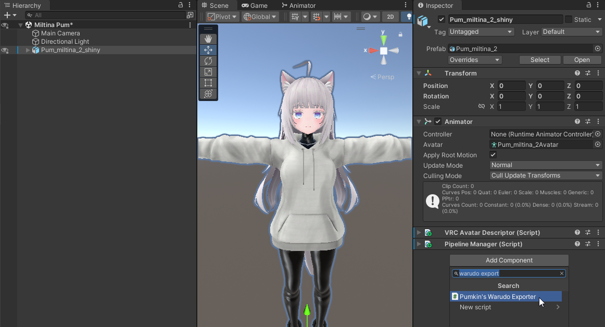
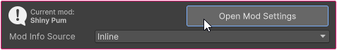
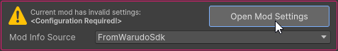
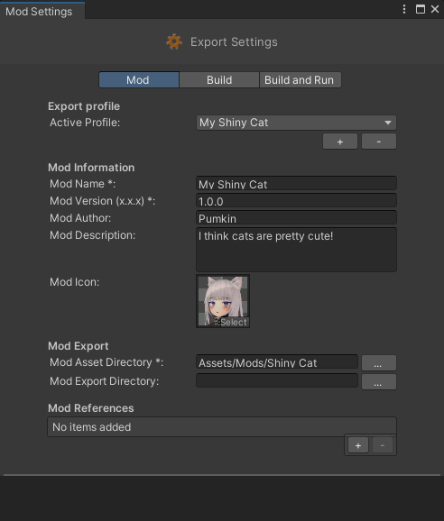
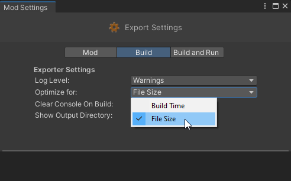
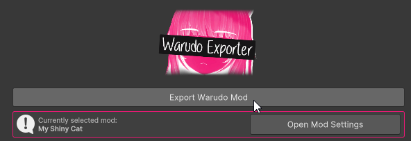

# Usage

## Add Component to Avatar
To use this, select your avatar in the scene, and add the `Pumkin's Warudo Exporter` component.

## Setting up a Mod

Before we can export, we need to configure our mod. There are 3 ways to do it, which can be changed by using the `Mod Info Source` dropdown.
- `Inline` (default): This lets you store the mod settings inside the exporter component itself.
- `From Asset`: This lets you store the mod info in an asset that can be reused by multiple avatars.
- `From Warudo SDK`: This is the old way of setting up a mod, using the Warudo Sdk menus.

Regardless of what info source you have selected, click the `Open Mod Settings` button to change the settings.

### Mod Info Source: Inline
By default, `Mod Info Source` is set to `Inline`, so this will expand our `Inline` mod settings. Fill in the information for your mod and you're ready to export.

If you would like to reuse these mod settings, you can click the `Save Inline  Mod Info to Asset` button to create a new mod info asset and assign it to the current avatar.

:::note

Only the `Name` field is required to export a mod, but it's also recommended to fill in the `Export Directory`.

:::

### Mod Info Source: From Asset
This is the same as inline except you get to choose what asset to pull the info from. Editing the info here will edit the asset so the changes will reflect on all avatars using it.

### Mod Info Source: From Warudo Sdk
This is the old way of setting up a mod. I don't recommend using it but you can.
Before you can export, you need to [setup a new mod](https://docs.warudo.app/docs/modding/creating-your-first-mod). This can be done in either one of these menus:
 - `Warudo` > `New Mod`
 - `Warudo` > `Mod Settings` and clicking the `+` button.

:::info

To be able to export, fill in the `Name`, `Version` and `Mod Asset Directory`. The mod asset directory needs to be an empty folder somewhere in your assets and it needs to exist.

:::

Fill in your mod info and pick a folder for your mod files. This needs to be somewhere in your `Assets`.

Before we export, there's a setting worth considering in the `Build` tab. The `Optimize for` option plays a decent role in the resulting filesize.
- When optimizing for `File Size` my Character Mod ends up being 25mb.
- When optimizing for `Build Time` my Character Mod ends up being 130mb.

I don't know what else this changes. I haven't noticed much difference in build or loading times when optiziming for build time. It might be irrelevant for small mods like these, but still worth keeping in mind.

### Exporting

To export, press the big export button! Yep, that's it!

For more info on what to do with your exported mods, check the [Warudo Documentation](https://docs.warudo.app/docs/modding/creating-your-first-mod).